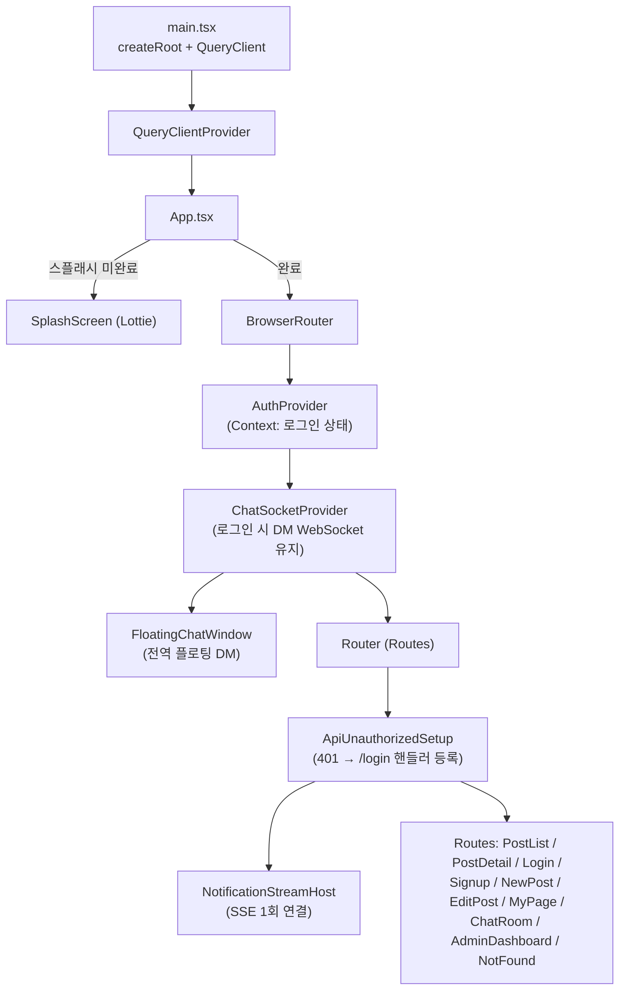
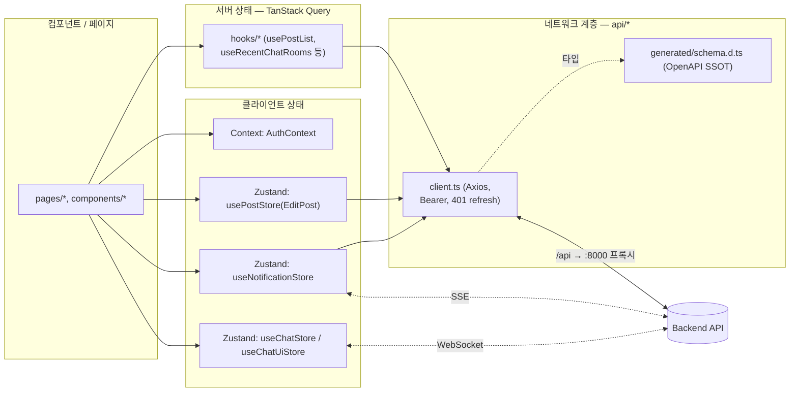
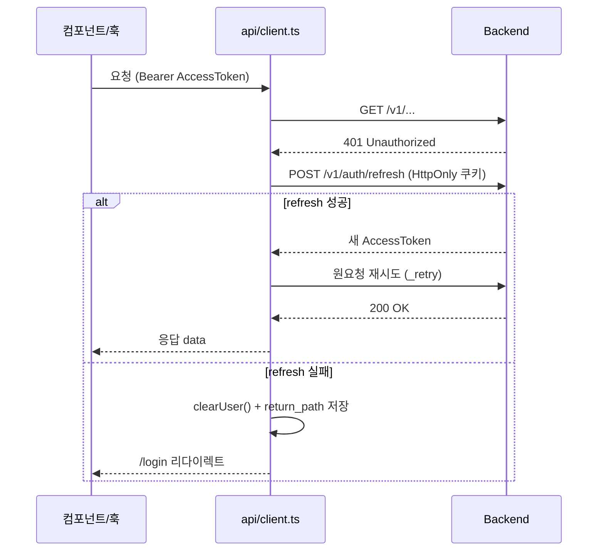

# PuppyTalk Frontend

> 🐕 **라이브 데모 — [puppytalk.shop](https://puppytalk.shop)**
> API: [api.puppytalk.shop/v1/docs](https://api.puppytalk.shop/v1/docs) · 데모 계정은 로그인 화면의 *"데모 계정으로 둘러보기"*

반려견 커뮤니티 **PuppyTalk**의 웹 클라이언트. React 19 + Vite 기반 SPA(CSR)로
회원가입·게시글·댓글·좋아요·해시태그 트렌드·프로필/차단·**1:1 DM 채팅(WebSocket)**·
**실시간 알림(SSE)**·관리자 기능을 제공합니다.

- **백엔드**: [PuppyTalk Backend](https://github.com/kyjness/puppytalk-be)
- **인프라·배포**: [PuppyTalk Infra](https://github.com/kyjness/puppytalk-infra)

> 코드베이스는 **100% TypeScript**입니다(`.tsx`/`.ts`). 서버 상태와 클라이언트 상태를
> 역할별로 분리하고, API 타입은 백엔드 OpenAPI 스펙에서 생성해 단일 출처(SSOT)로 씁니다.

---

## 기술 스택

| 구분 | 기술 | 비고 |
|------|------|------|
| **언어** | TypeScript 5 | 소스 전부 `.ts`/`.tsx`, `tsc --noEmit` 타입 게이트 |
| **프레임워크** | React 19 | 함수형 컴포넌트 + Hooks |
| **번들러** | Vite 8 | `@vitejs/plugin-react`, dev 프록시(`/api`·`/upload` → :8000) |
| **라우팅** | React Router 7 | SPA(CSR), `ProtectedRoute`로 인증 경로 보호 |
| **서버 상태** | TanStack Query 5 | 피드 무한 스크롤, 최근 DM 방·읽음, 채팅 상대 정보 등 |
| **클라이언트 상태** | Zustand 5 + React Context | Context=Auth, Zustand=게시글 수정·알림·채팅 소켓/세션/UI |
| **HTTP** | Axios | `withCredentials`, Bearer 토큰, 401 Silent Refresh |
| **실시간** | WebSocket + SSE | DM 채팅=WebSocket, 알림=`event-source-polyfill`(쿠키 전달) |
| **스타일** | Tailwind CSS 4 | `src/index.css` 단일 엔트리(`@theme`/`@layer`) |
| **아이콘** | lucide-react | |
| **무한 스크롤** | react-intersection-observer | `useInfiniteQuery`의 다음 페이지 트리거 |

---

## 아키텍처

### 렌더·프로바이더 트리



### 상태·데이터 아키텍처

서버에서 온 데이터(캐시·재검증 대상)와 순수 클라이언트 상태(UI·세션)를 **다른 도구로**
다룹니다. 컴포넌트는 axios를 직접 부르지 않고 훅으로 캡슐화된 query/mutation을 씁니다.



### 401 Silent Refresh

Access Token은 Authorization 헤더, Refresh Token은 HttpOnly 쿠키. 401을 받으면
클라이언트가 refresh를 시도하고 원요청을 1회 재시도합니다. refresh도 실패하면
로그아웃 후 `/login`으로 보내며, 돌아올 경로를 `sessionStorage`에 남깁니다.



---

## 폴더 구조

```
puppytalk-fe/
├── index.html                 # SPA 엔트리 (Pretendard 로컬 폰트 preload, Lottie)
├── img/                       # 정적 파일 (Vite publicDir: 'img')
│   ├── anim1~3.json           # 스플래시 Lottie
│   └── imt.png                # 기본 프로필·favicon (로컬 배치, 「사전 준비」참고)
├── fonts/                     # Pretendard woff2 (로컬 배치, /fonts/* 서빙)
├── scripts/                   # OpenAPI fetch / 타입 생성 스크립트(.mjs)
├── openapi.json               # (로컬 생성) 백엔드 OpenAPI 스펙 캐시
├── src/
│   ├── main.tsx               # 진입점: createRoot + QueryClientProvider
│   ├── App.tsx                # 스플래시 게이트 → BrowserRouter+Auth+ChatSocket+Router
│   ├── Router.tsx             # Routes, ProtectedRoute, 401 핸들러, NotificationStreamHost
│   ├── config.ts              # BASE_URL, DEFAULT_PROFILE_IMAGE, HEADER_TITLE, SPLASH_ITEMS
│   ├── index.css              # Tailwind v4 엔트리(테마·@font-face·리셋·모달·스켈레톤)
│   ├── api/                   # 네트워크 계층 + API 타입(SSOT)
│   │   ├── client.ts          # Axios 인스턴스, Silent Refresh, Bearer, credentials
│   │   ├── errors.ts          # ApiError 클래스 + getErrorCode
│   │   ├── posts.ts / media.ts# 게시글 피드·미디어 업로드 API
│   │   ├── api-types.ts       # ApiResponse<T>, DataOf 등 생성 스키마 얇은 래퍼
│   │   └── generated/schema.d.ts  # OpenAPI 기반 자동 생성 타입 (SSOT)
│   ├── context/AuthContext.tsx    # 인증 상태 컨텍스트 (복원/갱신/클리어)
│   ├── hooks/                 # 도메인별 query/mutation 훅 (login/post/profile/chat…)
│   ├── pages/                 # 라우트 단위 페이지
│   ├── components/            # 재사용 UI/기능 컴포넌트 (도메인 폴더 + 공통 평면 파일)
│   │   ├── Chat/              # DM: 소켓 프로바이더·플로팅 창·인박스·버블·입력
│   │   └── Notification/      # 실시간 알림 UI(벨·리스트·아이템) + 스트림 호스트
│   ├── store/                 # Zustand 저장소 (post/notification/chat/chatUi)
│   ├── types/                 # 앰비언트 타입 선언(.d.ts)
│   └── utils/                 # 공통 유틸 (XSS escape·날짜·에러 메시지·검증 등)
├── vite.config.js             # dev proxy: /api·/upload → 8000, WebSocket 업그레이드(ws:true)
├── tsconfig.json              # moduleResolution: bundler, noEmit 타입체크
├── eslint.config.js           # flat config (typescript-eslint + react-hooks)
└── package.json
```

> **참고**: import 지정자는 `moduleResolution: bundler` 덕에 `./App.jsx`처럼 써도
> 실제 `.tsx` 소스로 해석됩니다(런타임 확장자 표기일 뿐, 파일은 전부 TypeScript).

---

## 실행 방법

### 1. 사전 준비

- **Node.js** + **pnpm** (`corepack enable` 후 `package.json`의 `packageManager` 버전 사용)
- **백엔드 API** 실행 필요 → [백엔드 README](https://github.com/kyjness/puppytalk-be)
- **정적 에셋**(Git에 없을 수 있음 — 로컬 배치):
  - `img/imt.png` — 기본 프로필 이미지·favicon (`config.ts`의 `DEFAULT_PROFILE_IMAGE`)
  - `fonts/PretendardStd-{Regular,SemiBold,Bold}.woff2` — `index.html`·`index.css`에서 `/fonts/*` 참조
- 실시간 알림(SSE)은 백엔드 **Redis(REDIS_URL)** 설정이 필요합니다(없으면 스트림 503).
- DM 채팅은 동일 오리진 프록시(`vite.config.js`의 `ws: true`)가 맞아야 하며,
  프록시 설정을 바꾼 뒤에는 `pnpm dev`를 **재시작**하세요.

### 2. 백엔드 실행 (별도 터미널)

```bash
cd ../puppytalk-be
docker compose up --build -d    # DB·Redis·MinIO + API
```

`http://localhost:8000/v1/health` 200 확인 후 프론트를 띄웁니다.

### 3. 프론트엔드 실행

```bash
corepack enable   # 최초 1회
pnpm install
pnpm dev          # http://localhost:5173
```

개발 시 `/api`·`/upload`는 Vite 프록시로 `http://localhost:8000`에 전달됩니다.

### 4. 검사·빌드 스크립트

```bash
pnpm lint         # ESLint (flat config)
pnpm typecheck    # tsc --noEmit (0 errors 게이트)
pnpm build        # 프로덕션 빌드 (dist/)
pnpm preview      # 빌드 결과 로컬 미리보기
```

> CI(`.github/workflows/ci.yml`)는 push·PR마다 **install → lint → typecheck → build**를 실행합니다.

### 5. API 타입 생성 (OpenAPI Codegen, SSOT)

백엔드 스펙에서 TypeScript 타입을 생성합니다. **백엔드 기동 후** 실행하세요.

```bash
pnpm fetch-openapi   # openapi.json 내려받기 (기본 BACKEND_URL=http://localhost:8000)
pnpm generate-api    # src/api/generated/schema.d.ts 생성
```

백엔드 OpenAPI 스펙이 실제 응답과 동일하게 **camelCase**로 노출되므로 변환 없이 생성합니다.
타입은 `src/api/api-types.ts`에서 `PostResponse`, `ApiResponse<T>` 등으로 재노출합니다.

---

## API 연동 규약

- **Prefix**: `config.ts`의 `BASE_URL`은 개발 시 `/api/v1`(프록시로 8000의 `/v1`), 배포 시 `VITE_API_BASE_URL`로 오버라이드.
- **인증**: Access Token(Authorization Bearer) + Refresh Token(HttpOnly 쿠키). 401 시 refresh 후 재시도(위 시퀀스 참고).
- **응답 래퍼**: `{ code, data, message }`. 성공은 대개 `code: "OK"`, 목록은 `data.items`, 단일은 `data`.
- **DELETE 표준화**: 삭제/탈퇴는 `204` 대신 `200 + JSON(ApiResponse)`를 반환(과거 빈 바디 케이스는 클라이언트가 보수적으로 폴백).
- **문서**: 백엔드 실행 후 Swagger `http://localhost:8000/v1/docs`, ReDoc `/v1/redoc`.

---

## 상태 관리 원칙

- **서버 상태 = TanStack Query.** 서버가 소유하는 데이터(피드·DM 방·읽음·상대 정보)는
  쿼리/뮤테이션 훅(`hooks/*`)으로만 다루고, 캐시·재검증·낙관적 업데이트를 Query에 위임.
- **클라이언트 상태 = Zustand / Context.** UI·세션처럼 서버가 소유하지 않는 상태만.
  Context는 Auth 전역 하나, 나머지는 Zustand(게시글 수정·알림·채팅 소켓/UI).
- **역할 혼용 금지.** 서버 데이터를 Zustand에 캐싱하거나 UI 상태를 Query에 넣지 않음.
- **API 타입 SSOT.** 수기 타입 중복 정의 대신 `generated/schema.d.ts`에서 파생.

---

## 배포·설정

- **API 주소**: 빌드 시 `VITE_API_BASE_URL`로 실제 API 베이스 지정(예: `https://api.example.com/v1`).
- **정적 파일**: `img/`가 publicDir이므로 `/anim1.json` 등은 `img/` 기준으로 서빙됩니다.
  `imt.png`·`fonts/`는 프로젝트 루트에 두면 dev·빌드 모두 동일 오리진(`/imt.png`, `/fonts/*`)으로 접근됩니다.

---

## 확장 전략 (SEO·SSR/SSG 전환 계획)

현재는 React + Vite **SPA(CSR)**. 검색 유입(SEO)·초기 로딩이 중요한 일부 공개 페이지는
**Next.js 기반으로 단계적 전환**을 계획하고 있습니다.

- **대상(예시)**: 게시글 목록/상세, 공개 프로필 등 검색 노출 가치가 큰 공개 페이지
- **전환 방식**: 페이지 성격에 따라 SSR 또는 SSG/ISR(나머지 기능성 페이지는 CSR 유지)
- **원칙**: API 계약(OpenAPI 타입, `ApiResponse` 형태)은 유지하고 라우팅/렌더링 레이어만 점진 분리
